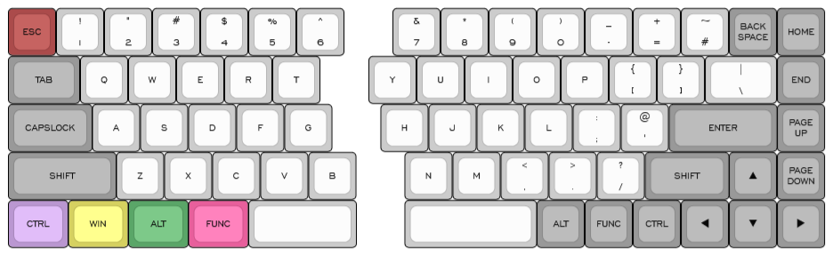
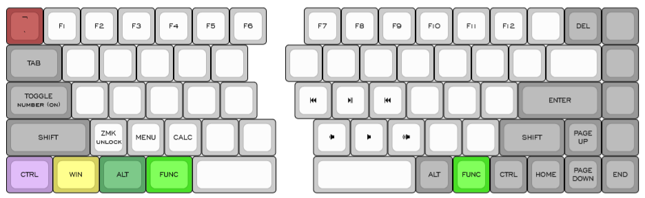
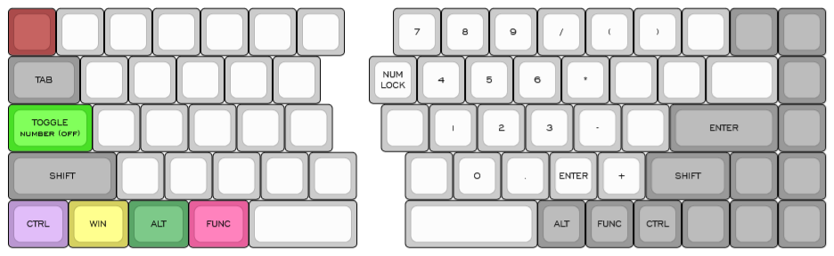

# Quefrency layout

A ZMK[^zmk] configuration for keebio Quefrency[^quefrency] rev1 in no macro 65%
layout with split backspace. With Prospector Dongle[^prospector] and ZMK
Studio[^studio] support.

Can't use the in-tree ZMK Quefrency[^zmk-quefrency] configuration because a
matrix-transform is only available for 2u backspace at time of writing.

## Layers
### Base layer

### Function layer

### Number layer

[^zmk]: [ZMK Firmware](https://github.com/zmkfirmware/zmk)
[^prospector]: [Prospector Dongle](https://github.com/carrefinho/prospector)
[^studio]: [ZMK Studio](https://github.com/zmkfirmware/zmk-studio)
[^quefrency]: [Quefrency rev1](https://github.com/keebio/quefrency-rev1-pcb) ([store](https://keeb.io/collections/quefrency-split-staggered-65-keyboard))
[^zmk-quefrency]: [Quefrency in ZMK](https://github.com/zmkfirmware/zmk/tree/v0.3/app/boards/shields/quefrency)

